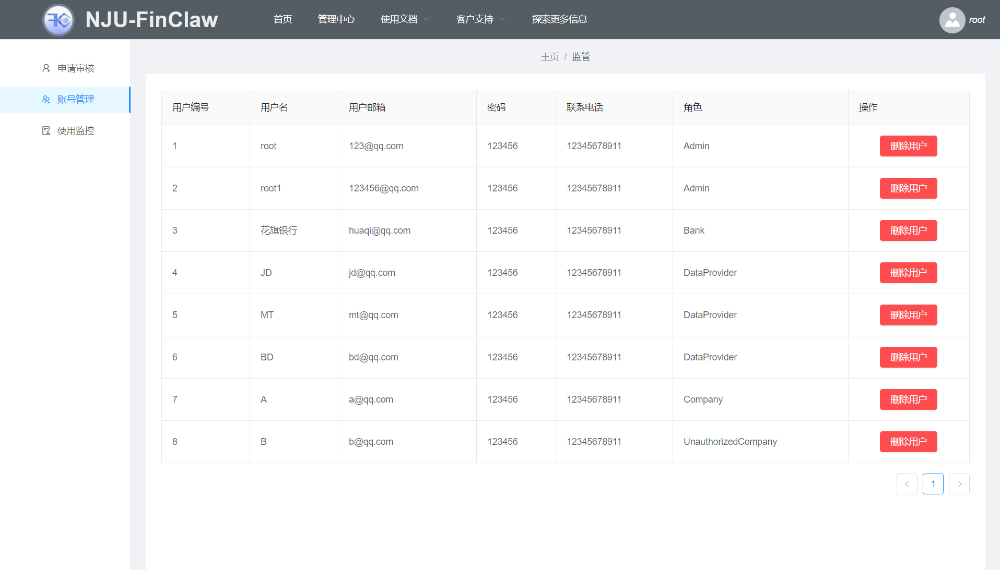

# Finclaw user guide

## 1. Introduction

### 1.1 Writing purpose

​		In order to allow users of the finclaw platform to become familiar with the various functions and operating procedures of the platform in the first time, the 用户手册 has been specially compiled to provide convenience for users and solve a series of questions when using this platform.

### 1.2 Target audience

​		Finclaw platform administrators, bank staff, data providers and small and micro companies.

## 2. Operating environment

### 2.1 Hardware conditions

#### 2.1.1 Trainers participating in federated learning

Recommended configuration
| CPU | Memory | GPU |System|
|---|---|---|---|
| 2 cores | 8GB | Optional |Linux|

#### 2.1.2 Small and micro enterprises

​ Unlimited hardware conditions

### 2.2 Software conditions

-Operating system: unlimited.
-Browser: Chrome and Edge are recommended.

## 3. Operating Procedures

### 3.1 Platform homepage

#### 3.1.1 Home

1. On the homepage, you can browse all published projects through the project column, and click on a specific project to enter the project details page
2. Account registration and login can be done through the top navigation bar

#### 3.1.2 Project Details Page

1. View the introduction of the project by the initiator on the details page
2. After logging in, you can click the Join button to join the project

#### 3.1.3 Registration

1. Select the identity ("bank", "data provider", "enterprise") when registering, fill in the relevant information and submit the registration application
2. After the registration is submitted, you can log in, but it will be in an uncertified state. You need to submit certification materials to the platform administrator for review. After the review is completed, you can use the platform related functions normally

#### 3.1.4 Login

1. Fill in the account password to log in

#### 3.1.5 Submit certification materials

1. Select local certification materials and click the "Upload File" button to upload, and then wait for the administrator to review

### 3.2 Platform Administrator

#### 3.2.1 Account registration review

1. Browse the account registration application and application materials, and choose to agree or decline
#### 3.2.2 Account Management

1. Delete user account
#### 3.2.3 Use monitoring

1. Able to see the operation records of each user
### 3.3 Bank
#### 3.3.1 Project browsing

1. Browse projects initiated by the bank, and choose to manage, modify, or delete projects under the corresponding project card
2. Click the card for creating a project to create a new project
#### 3.3.2 Create Project

1. Click on the card to create the project
2. After filling in the pop-up dialog box, click OK to complete the creation of the project
#### 3.3.3 Modify the project

1. Click the edit button under the card of the item you want to edit
2. Fill in the pop-up dialog box and click OK to complete the project modification

#### 3.3.4 Delete project

1. Click the delete button under the card of the item you want to delete
2. Click Yes in the pop-up confirmation box to confirm the deletion

#### 3.3.5 Processing loan application

1. After a small and micro enterprise initiates a loan application, the application can be seen on the loan application page
2. After evaluating the company, the bank refers to the recommended strategy given by the system to give the company its willingness to lend

#### 3.3.6 View Will Record

1. The given willingness to lend can be seen here

#### 3.3.7 Project data display

1. Click on the specific project card to enter the project management page
2. You can see project-related data on this page

#### 3.3.8 Project Authority Management

1. Select project authority management to enter the authority management page
2. Click the permission control operation button to modify the permissions of the specific participants

#### 3.3.9 Project deployment, upload, training

1. Configure the project on the project configuration page according to the different stages of the project (deployment, upload, training)

#### 3.3.10 Predict corporate credit and recommend lending strategies

1. Enter the information of the company to be predicted, and call the trained model for credit prediction to obtain the company's credit score
2. The platform will recommend lending plans based on credit scores

#### 3.3.11 Bank credit strategy recommendation

1. After entering the total amount of funds, click the recommend button, and the platform will recommend the loan strategy according to its own recommendation algorithm

### 3.4 Data provider

#### 3.4.1 Join the project

1. You can select specific projects to join under the non-participated projects in the processing center
2. You can also click the Join button on the project details page to join the training project
#### 3.4.2 Upload server information

1. Select the project-configuration in the added project, fill in the server information and click the modify button to upload the server information
#### 3.4.3 Preparation for training

1. Upload the training data set on the training server, select the project-preparation in the added project, and click the prepare button to complete the training preparation
#### 3.4.4 Exit the project

1. Click the Exit button to exit the project
### 3.5 Small and Micro Enterprises

#### 3.5.1 Loan Application

1. Fill out the loan application form and click OK to initiate the loan application
#### 3.5.2 Application Management

1. The initiated loan application can be viewed on the application management page
2. After each bank gives a loan willingness, one of them can be accepted
#### 3.5.3 Loan Results

1. All loan results will be recorded on this page

## 4. Error message and problem solving

### 4.1 Common problems and solutions

1. When you jump to the management center, it prompts "The review failed, please submit the review materials to the information page" or "The review was rejected, please go to the information page to resubmit materials"
Solution: You need to click **My Information** under the user avatar in the top navigation bar to submit the review materials on the material submission page
2. Project training cannot start
Solution: first check whether the server information is configured correctly, and then check whether the server is successfully deployed according to the process, if there are still problems, please contact the platform administrator

## 5. Appendix

### 5.1 Reference List

1. Finclaw Requirements Document
2. Finclaw database documentation
3. FInclaw test document