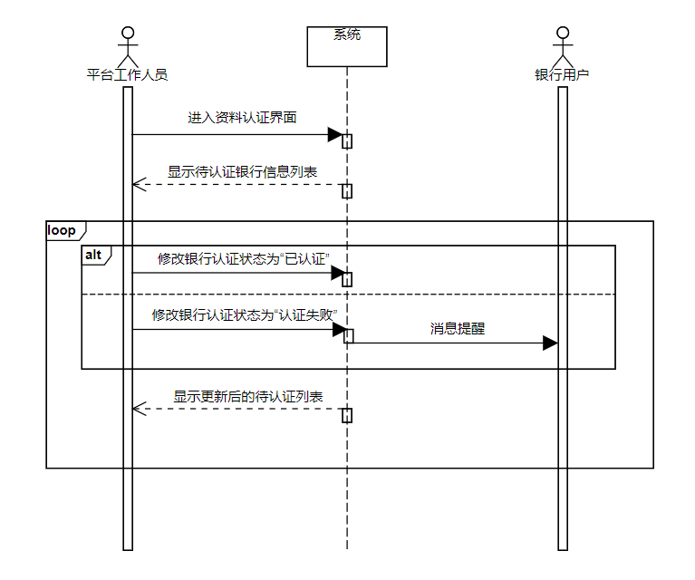
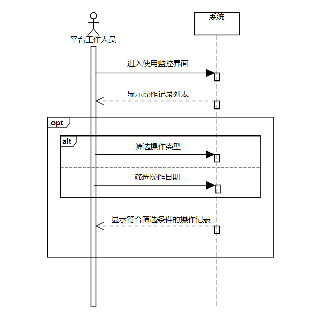
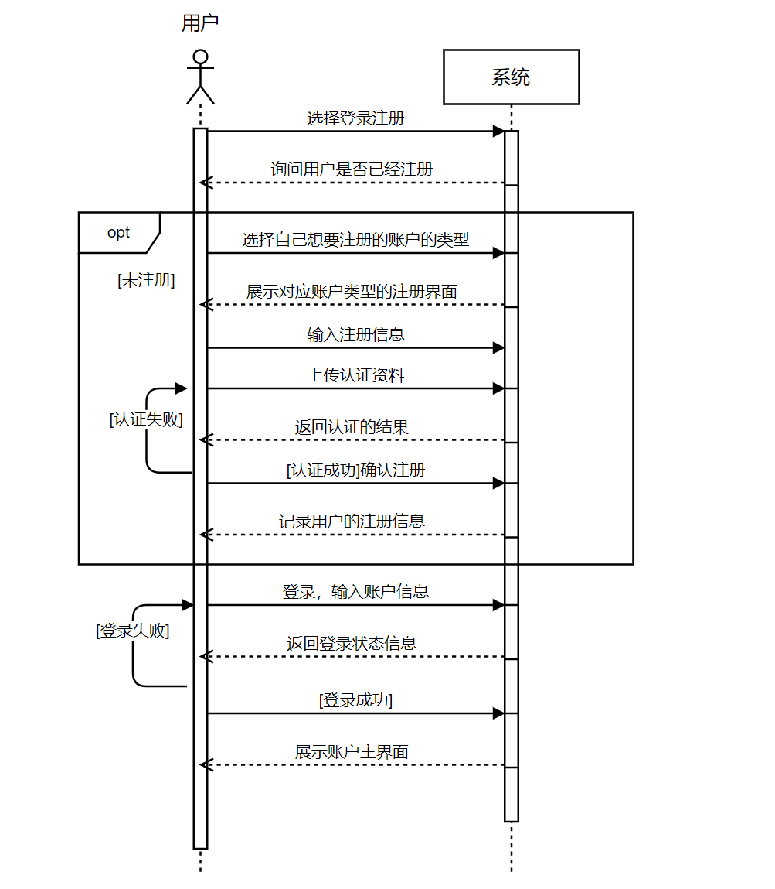
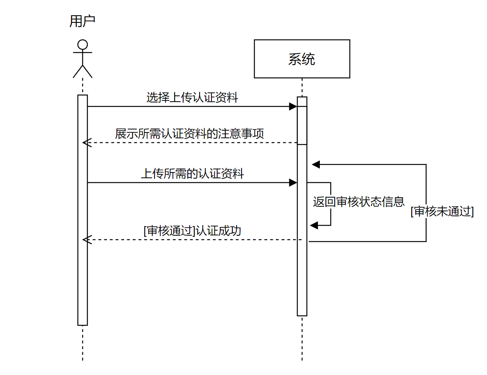
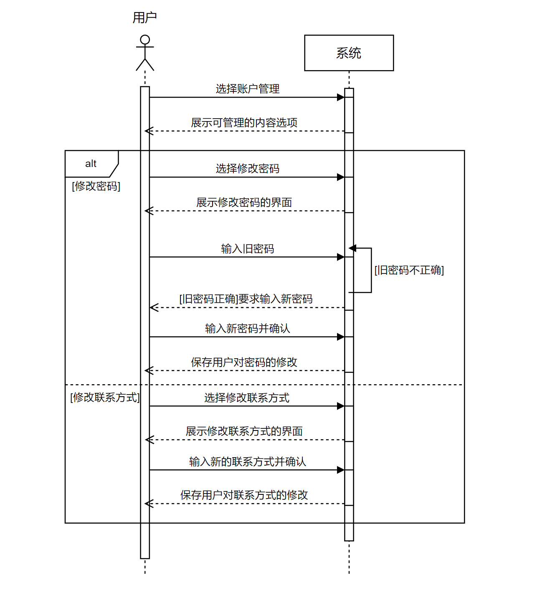

# FinClaw用例文档

## 1. 主要角色

|     角色     | 简要描述                                                |
| :----------: | ----------------------------------------------------- |
|     银行     | 发起联邦学习项目的一方，同时也是发放贷款的一方               |
|  数据提供方  | 单纯提供数据的一方                                         |
| 借款小微企业 | 在平台上提出借款申请的用户                                   |
| 平台工作人员 | 平台的管理者，主要负责入驻的用户的管理，需要对他们进行资质认证，同时还要能够监控各方的行为 |

## 2. 用例图

==TODO== 等所有确定后再画

## 3. 用例列表

### 3.1 银行

1. 项目管理
2. 信用评级策略管理
3. 浏览贷款申请
4. 发放贷款

### 3.2 数据提供方

1. 服务器信息管理
2. 项目管理

### 3.3 借款小微企业

1. 申请借款
2. 借贷情况查看
3. 接受贷款

### 3.4 平台工作人员

1. 资料认证
2. 使用监控

### 3.5 公共部分

1. 登录注册
2. 认证资料上传
3. 账户管理

## 4. 详细用例描述

### 4.1 银行

#### 4.1.1 项目管理

- ID：AUR1

- 名称：项目管理

- 优先级：高

- 参与者：银行工作人员

- 触发条件：银行工作人员选择进行项目管理

- 前置条件：银行工作人员已经登录并被授权

- 后置条件：系统记录项目更新后的情况，并在平台上进行更新

- 正常流程：

  1. 银行工作人员选择进行项目管理
  2. 系统展示所有已有的项目
  3. 银行工作人员选择创建新的项目
  4. 系统跳转至创建项目页面
  5. 银行工作人员填写项目基本信息，并提交
  6. 系统审核信息完整性，存储并在平台发布创建的项目

- 扩展流程：

  1a. 银行工作人员选择进行项目信息修改
  	1. 系统展示选择修改的项目的原有信息
  	2. 银行工作人员修改项目信息并提交
  	3. 跳转至正常流程6

  1b. 银行工作人员选择删除某个项目

  1. 系统将项目从平台中删除，并通知所有已经参与该项目的合作方

  6a. 工作人员填写的信息不完整

  1. 系统提示信息缺失，并要求用户继续填写，跳转至正常流程5

- 业务规则：

  BR1：创建项目需要填写的基本信息包含项目名称、项目描述、报名截止时间

- 特殊需求：无

#### 4.1.2 信用评级策略管理

- ID：AUR2

- 名称：信用评级策略管理

- 优先级：高

- 参与者：银行工作人员

- 触发条件：银行工作人员选择进行信用评级策略管理

- 前置条件：银行工作人员已经登录并被授权

- 后置条件：系统保存更新后的信用评级策略

- 正常流程：

  1. 银行工作人员选择进行信用评级策略管理
  2. 系统展示已有的信用评级策略
  3. 银行工作人员修改信用评级策略具体信息并提交
  4. 系统保存修改后的信用评级策略

- 扩展流程：

  1a. 银行工作人员选择的是创建新的信用评级策略

  1. 系统展示一个新的信用评级策略表单，回到正常流程3

  4a. 银行工作人员填写的信息不完整

  1. 系统提示信息不完整并要求银行工作人员重新填写，回到正常流程3

- 业务规则：无

- 特殊需求：无

#### 4.1.3 浏览贷款申请

- ID：AUR3

- 名称：浏览贷款申请

- 优先级：高

- 参与者：银行工作人员

- 触发条件：银行工作人员选择浏览所有贷款申请

- 前置条件：银行工作人员已经登录并被授权

- 后置条件：无

- 正常流程：

  1. 银行工作人员选择进行贷款申请
  2. 系统展示平台上的所有贷款申请以及申请贷款的小微企业的信用评分
  3. 银行工作人员选择查看某个贷款申请的小微企业的情况
  4. 系统展示该小微企业的具体情况

- 扩展流程：

  1a. 银行工作人员选择按照申请贷款的小微企业的信用评分的高低进行排序

  1. 系统将申请按照小微企业的信用评分排序进行展示

  1b. 银行工作人员选择按照申请贷款的金额数目进行排序

  1. 系统将申请按照贷款额度进行排序后展示

- 业务规则：无

- 特殊需求：无

#### 4.1.4 发布贷款

- ID：AUR4

- 名称：发布贷款

- 优先级：高

- 参与者：银行工作人员

- 触发条件：银行工作人员选择进行贷款发布

- 前置条件：银行工作人员已经登录并被授权

- 后置条件：系统将银行发放贷款的信息发送给申请贷款的小微企业

- 正常流程：

  1. 银行工作人员选择为某个贷款申请发放贷款
  2. 系统提示银行工作人员输入密码进行身份验证
  3. 银行工作人员输入密码
  4. 系统验证成功后，将发放贷款的信息发送给申请贷款的小微企业

- 扩展流程：

  4a. 若银行工作人员输入的密码错误

  1. 系统提示密码错误，并要求银行工作人员重新输入，若错误超过5次，则冻结账号

- 业务规则：无

- 特殊需求：无

### 4.2 数据提供方

### 4.3 借款小微企业

#### 4.3.1 申请借款

- ID：CUR1

- 名称：申请借款

- 优先级：高

- 参与者：借款小微企业、银行

- 触发条件：小微企业用户申请借款

- 前置条件：小微企业用户已经注册并登陆，且身份认证通过了平台审核

- 后置条件：系统保存企业的申请记录

- 正常流程：
  1. 小微企业用户在[主页]点击[借款]
  2. 系统进入可借款银行页面
  3. 小微企业用户选择要借款的银行
  4. 系统进入银行的借贷详情页面
  5. 小微企业查看详情后，选择借款额度
  6. 系统提交借款申请给目标银行
  
- 扩展流程：

  ​		5a.小微企业用户了解详情后放弃在此银行借贷

  ​			1.系统返回可借款银行页面

- 业务规则：

  BR1：如果小微企业的信用评分低于银行要求，则不能向该银行发起借款申请。

  BR2：小微企业的借款申请需要在15日内处理，逾期未处理的视为过期申请，状态变为无效。

- 特殊需求：无

#### 4.3.2 借贷情况查看

- ID：CUR2

- 名称：借贷情况查看

- 优先级：高

- 参与者：借款小微企业

- 触发条件：小微企业用户查看自身贷款情况

- 前置条件：小微企业用户已经登陆

- 后置条件：无

- 正常流程：

  1. 小微企业用户在[我的]页面点击[借贷情况]
  2. 系统进入借贷情况页面
  3. 小微企业用户查看某次借贷详细情况
  4. 系统返回借贷详情
  5. 小微企业用户选择[返回]或关闭窗口
  6. 系统返回上一级页面或退出

- 扩展流程：

  ​		无

- 业务规则：

  BR1：借贷记录中应保持业务所需要的所有字段信息

- 特殊需求：

  SR1：小微企业用户需要看到记录中借贷、还款的状态

#### 4.3.3 接受贷款

- ID：CUR3

- 名称：接受贷款

- 优先级：高

- 参与者：借款小微企业、银行

- 触发条件：银行同意小微企业的贷款申请

- 前置条件：小微企业用户已经登陆

- 后置条件：系统记录此次贷款操作

- 正常流程：

  1. 小微企业用户查看贷款申请
  2. 系统进入贷款申请详情页
  3. 小微企业用户确认接受贷款
  4. 系统弹出窗口进行二次确认
  5. 小微企业用户点击确认
  6. 系统执行贷款操作，并向小微企业用户和银行发送贷款成功提醒，系统记录此次贷款

- 扩展流程：

  ​		3a.小微企业用户拒绝接受贷款

  ​			1.系统弹出窗口进行二次确认

  ​			2.小微企业用户点击[确定]

  ​			3.系统执行取消贷款操作，并向小微企业用户和银行发送				取消贷款提醒

  ​		5a.小微企业用户点击取消

  ​			1.系统回到贷款申请详情页

- 业务规则：

  BR1：接受贷款后，银行需要在3个工作日内将资金打到用户的账号中

  BR2：用户需在规定日期前归还贷款，否则每日需要加收贷款总额1%的超期罚款

- 特殊需求：

  SR1：系统自动计算当前借贷项中需要还款的金额

### 4.4 平台工作人员

#### 4.4.1 资料认证

<table>
    <tr>
        <td><b>ID</b></td>
        <td>4.4.1</td>
        <td><b>名称</b></td>
        <td>资料认证</td>
    </tr>
    <tr>
        <td><b>创建者</b></td>
        <td>曹英瑞</td>
        <td><b>最后一次更新者</b></td>
        <td></td>
    </tr>
    <tr>
        <td><b>创建日期</b></td>
        <td>2021/1/29</td>
        <td><b>最后更新日期</b></td>
        <td></td>
    </tr>
    <tr>
        <td><b>参与者</b></td>
        <td colspan="3">平台工作人员，目标是根据银行提供的资料（包括银行名称、营业执照、联系人姓名、联系方式）认证其身份</td>
    </tr>
    <tr>
        <td><b>触发条件</b></td>
        <td colspan="3">平台工作人员进入资料认证界面</td>
    </tr>
    <tr>
        <td><b>前置条件</b></td>
        <td colspan="3">银行资料已提交</td>
    </tr>
    <tr>
        <td><b>后置条件</b></td>
        <td colspan="3">更新银行账号的认证状态</td>
    </tr>
    <tr>
        <td><b>正常流程</b></td>
        <td colspan="3">
        1. 平台工作人员进入资料认证界面 
        2. 系统显示待认证的银行信息列表 
        3. 平台工作人员核实认证信息 
        4. 平台工作人员更改银行的认证状态为“已认证” 
        5. 系统保存修改并更新显示待认证的银行信息列表</td>
    </tr>
    <tr>
        <td><b>扩展流程</b></td>
        <td colspan="3">
        3a. 银行提供的认证信息不符合要求 
        &nbsp;&nbsp;&nbsp;&nbsp; 4. 平台工作人员更改银行的认证状态为“认证失败”</td>
    </tr>
</table>

#### 4.4.2 使用监控

<table>
    <tr>
        <td><b>ID</b></td>
        <td>4.4.2</td>
        <td><b>名称</b></td>
        <td>使用监控</td>
    </tr>
    <tr>
        <td><b>创建者</b></td>
        <td>曹英瑞</td>
        <td><b>最后一次更新者</b></td>
        <td></td>
    </tr>
    <tr>
        <td><b>创建日期</b></td>
        <td>2021/1/29</td>
        <td><b>最后更新日期</b></td>
        <td></td>
    </tr>
    <tr>
        <td><b>参与者</b></td>
        <td colspan="3">平台工作人员，目标是查看用户的操作记录（包括操作用户名、操作日期、操作类型、操作内容）</td>
    </tr>
    <tr>
        <td><b>触发条件</b></td>
        <td colspan="3">平台工作人员进入使用监控界面</td>
    </tr>
    <tr>
        <td><b>前置条件</b></td>
        <td colspan="3">无</td>
    </tr>
    <tr>
        <td><b>后置条件</b></td>
        <td colspan="3">系统显示用户操作记录</td>
    </tr>
    <tr>
        <td><b>正常流程</b></td>
        <td colspan="3">
        1. 平台工作人员进入使用监控界面 
        2. 系统显示操作记录列表</td>
    </tr>
    <tr>
        <td><b>扩展流程</b></td>
        <td colspan="3">
        3a. 平台工作人员筛选操作类型 
        &nbsp;&nbsp;&nbsp;&nbsp; 4. 系统显示属于对应类型的操作记录 
        3b. 平台工作人员筛选操作日期 
        &nbsp;&nbsp;&nbsp;&nbsp; 4. 系统显示在所选时间范围内的操作记录</td>
    </tr>
</table>

### 4.5 公共部分

#### 4.5.1 登录注册

- ID：1

- 名称：登录注册

- 优先级：高

- 参与者：银行、数据提供方、借款小微企业

- 触发条件：使用者选择登录注册

- 前置条件：无

- 后置条件：系统记录用户的登录注册信息

- 正常流程：

  1. 使用者选择登录注册
  2. 使用者注册，选择自己想要注册的账户的类型
  3. 使用者输入注册信息
  4. 使用者进行认证资料的上传
  5. 使用者认证成功，注册完成
  6. 使用者登录
  7. 使用者登录成功，进入主界面

- 扩展流程：

  2a. 使用者已经注册

  1. 跳转到正常流程6

  5a. 使用者认证失败

  1. 跳转到正常流程4，重新进行认证资料的上传

  7a. 使用者登录失败

  1. 跳转到正常流程6，重新进行登录

- 业务规则：

  BR1：登录和注册均需要验证码

  BR2：注册的账户类型包括银行、数据提供方、借款小微企业

- 特殊需求：无

#### 4.5.2 认证资料上传

- ID：2

- 名称：认证资料上传

- 优先级：高

- 参与者：银行、数据提供方、借款小微企业、平台工作人员

- 触发条件：使用者选择上传认证资料

- 前置条件：无

- 后置条件：系统记录认证资料

- 正常流程：

  1. 使用者选择上传认证资料
  2. 使用者上传对应所需的认证资料
  3. 审核工作人员对使用者上传的认证资料进行审核
  4. 审核通过，认证成功，使用者完成认证资料上传

- 扩展流程：

  4a. 审核未通过

  1. 跳转到正常流程2，使用者重新上传认证资料

- 业务规则：

  BR1：认证资料包括

- 特殊需求：无

#### 4.5.3 账户管理

- ID：3

- 名称：账户管理

- 优先级：高

- 参与者：银行、数据提供方、借款小微企业

- 触发条件：使用者选择账户管理

- 前置条件：无

- 后置条件：系统记录使用者对账户信息的修改

- 正常流程：

  1. 使用者选择账户管理
  2. 使用者选择自己想要进行修改的内容进行管理
  3. 系统保存使用者对信息的修改

- 扩展流程：

  2a. 使用者选择修改密码

  1. 使用者输入旧密码

  2. 旧密码验证成功，使用者输入新密码并二次确认

     2i. 输入的旧密码不正确

     1. 跳转到扩展流程2a，使用者重新进行密码的修改

  2b. 使用者选择修改联系方式

  1. 使用者输入新的联系方式并确认

- 业务规则：无

- 特殊需求：无

## 5. 需求分析模型（系统顺序图）

### 5.1 银行

### 5.2 数据提供方

### 5.3 借款小微企业

### 5.4 平台工作人员

#### 5.4.1 资料认证

#### 5.4.2 使用监控

### 5.5 公共部分

#### 5.5.1 登录注册

 

#### 5.5.2 认证资料上传

#### 5.5.3 账户管理 

